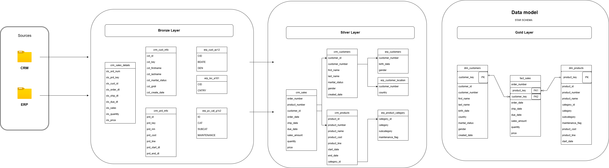
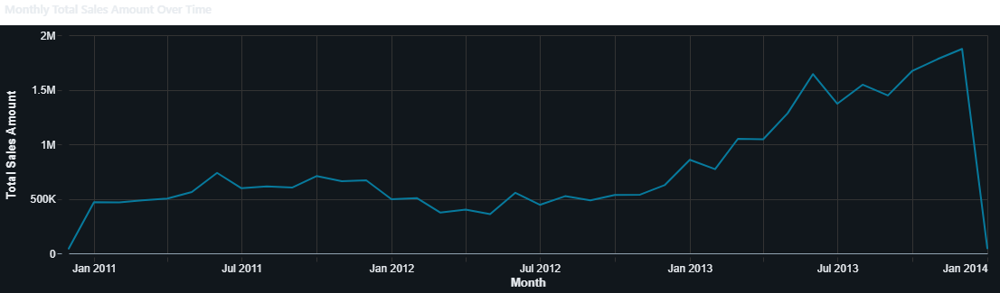
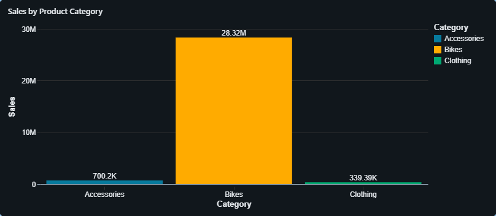
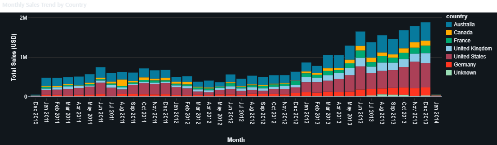
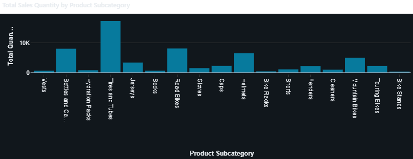
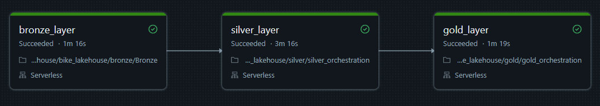
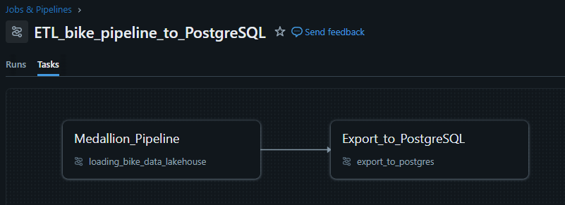
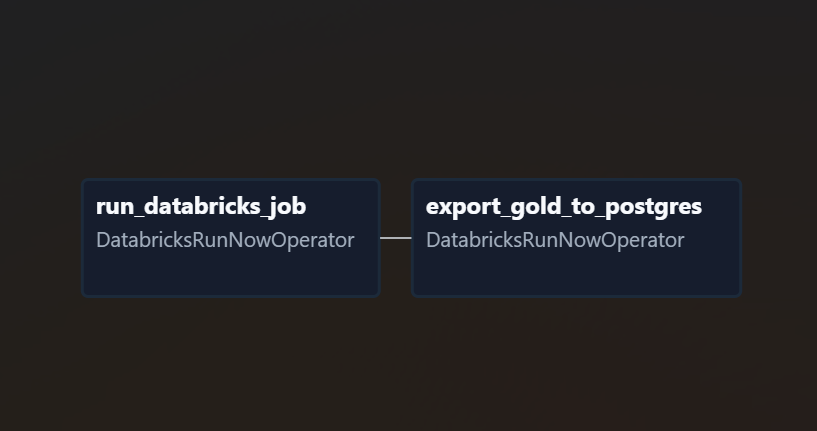

# Databricks Data Lakehouse Project

This repository contains a complete, real-world Data Lakehouse implementation built using **Databricks**, **Apache Spark**, **Delta Lake**, and **Airflow**.

-------------------------------
### Architecture

This project follows the **Medallion Architecture**:


#### Bronze Layer – Raw Data

Store raw ingested data without any transformation.
- Raw data ingestion
- Schema inference and storage as Delta tables

#### Silver Layer – Cleaned Data

Transform raw datasets into reliable structured tables.

- Data Cleansing

- Data Standardization

- Data Normalization

- Derived Columns

- Data Enrichment

- Sanity Checks


#### Gold Layer – Business Model

Deliver analytics-ready datasets.
- Dimensional Data Model (Business Transformation)
- Star Schema (3 tables: **fact_sales, dim_customers, dim_products**)

----------

### Data Model



----------
### Dashboards - Performance Analytics

Examples:

1. **Sales trend over time**



2. **Sales by Product Category**



3. **Monthly Sales Trend by Country**



4. **Total Sales Quantity by Product Subcategory**



----------

### Bonus adjustment

**Silver Layer - silver_updated**

Use **cleaning_data.py** file with reusable Python functions to reduce repetition.

----------

### Building the Pipeline

**Current Setup**
- 1 Bronze notebook
- 6 Silver transformation notebooks
- 3 Gold notebooks (dimensions and facts)

Note: To run each Layer properly, I use orchestration notebooks (silver_orchestration & gold_orchestration), that trigger all notebooks of each layer.

-------
### Pipeline Workflow

- Load raw dataset into Bronze tables
- Clean and transform into Silver tables
- Build business-ready Gold tables designed for analytics and reporting



--------

### Technologies 
- Databricks
- Apache Spark
- PySpark
- Spark SQL
- Delta Lake
- Unity Catalog

-----------

### Acknowledgements

The core Databricks Medallion Architecture pipeline was developed as part of a Data Engineering Bootcamp led by **Data With Baraa**.

The **Airflow orchestration layer and PostgreSQL export pipeline were designed and implemented independently as an extension to the original project.**

This addition demonstrates how the Databricks pipeline can be integrated into a real-world production workflow using:

- **Apache Airflow (Astro Runtime)** for orchestration
- **Docker** for local infrastructure
- **PostgreSQL** as a serving layer
- **JDBC export pipelines**

----------

## Project Extension - Use Airflow and Astro

**Without Airflow - Databricks Jobs only**



-------
## Airflow

### Orchestration Architecture

The pipeline separates compute processing from workflow orchestration.
```
Airflow (Astro)
      │
      │ triggers
      ▼
Databricks Workflows
      │
      │ transforms data
      ▼
Gold Tables
      │
      │ export via JDBC
      ▼
PostgreSQL
```
**Design Principle**
- Databricks → heavy data processing
- Airflow → orchestration and scheduling

### Pipeline Structure


```
Airflow DAG
   │
   ├── Job 1: Medallion Pipeline
   │       Bronze → Silver → Gold
   │
   └── Job 2: Serving / Export
           Gold → PostgreSQL (JDBC)
```

## Project Structure
```
databricks_bike_lakehouse/
│
├── bike_lakehouse
│   ├── bronze_layer
│   ├── silver_layer
│   ├── gold_layer
│   ├── serving (export to PostgreSQL)


```

### Airflow DAG



---

### Running Airflow Locally (Astro)

Start Airflow on your local machine by running 'astro dev start'.
This command will spin up 4 Docker containers on your machine, each for a different Airflow component:

- Postgres: Airflow's Metadata Database
- Webserver: The Airflow component responsible for rendering the Airflow UI
- Scheduler: The Airflow component responsible for monitoring and triggering tasks
- Triggerer: The Airflow component responsible for triggering deferred tasks

Verify that all 4 Docker containers were created by running 'docker ps'.

Note: Running 'astro dev start' will start your project with the Airflow Webserver exposed at port 8080 and Postgres exposed at port 5432. If you already have either of those ports allocated, you can either stop your existing Docker containers or change the port.

Access the Airflow UI for your local Airflow project. To do so, go to http://localhost:8080/ and log in with 'admin' for both your Username and Password.
You should also be able to access your Postgres Database at 'localhost:5432/postgres'.


---
### Configure Databricks Connection in Airflow

- Add the provider to Astro project. 
   In requirements.txt add "apache-airflow-providers-databricks"
- Create Airflow connection (Airflow UI)

Typical settings:

| Field           | Value                         |
|-----------------|-------------------------------|
| Connection Id   | `databricks_default`          |
| Connection Type | `Databricks`                  |
| Host            | `https://<databricks-instance>` |
| Password        | `Databricks PAT token`        |

